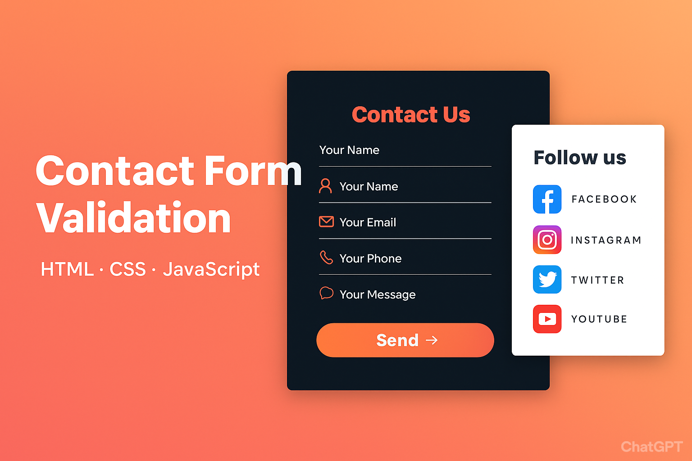

# Responsive Contact Form Validation

A modern and interactive contact form built using **HTML, CSS, and JavaScript**.  
Designed with a **dark theme**, gradient buttons, and responsive layout, this form includes **real-time validation, localStorage support**, and a **Reset button** for better user experience.

---

## 🌟 Key Features

- **Real-time validation**: Instant feedback while typing for name, email, and message.  
- **Email format validation**: Uses **regex** to ensure valid email input.  
- **LocalStorage support**: Automatically saves input data so users don’t lose progress on page refresh.  
- **Reset button**: Clears all form fields and stored data instantly.  
- **Responsive design**: Works perfectly on desktop, tablet, and mobile devices.  
- **User-friendly UI**: Clean dark theme with gradient “Send” button and icons.  
- **Social links panel**: Side panel for following on Facebook, Instagram, Twitter, and YouTube.

---

## 📋 How It Works

1. User fills out the form.  
2. Inputs are validated **live**, showing errors or success in real-time.  
3. Data is automatically saved in **localStorage**.  
4. On page reload, the saved data is restored.  
5. Submit the form to clear the data and display a success message.  
6. Click **Reset** to clear the form manually at any time.

---

### 🖥️ Demo Screenshot

---

## 🛠️ Technologies Used

HTML5

CSS3 (Flexbox, Gradient, Responsive Design)

JavaScript (DOM Manipulation, Regex, LocalStorage)

Font Awesome for icons

## 📂 File Structure
Responsive-Contact-Form/
│
├─ index.html             # Main HTML page
├─ css/
│   └─ style.css          # Stylesheet
├─ js/
│   └─ script.js          # JavaScript for validation & localStorage
├─ assets/
│   └─ preview.png        # Screenshot for README
└─ README.md              # Project documentation

---

## 🚀 Getting Started

1. Clone the repository or download the zip file.
2. Extract the contents to a folder.
3. Open `index.html` in a web browser to view the form.
4. Start customizing the form by editing the HTML, CSS, and JavaScript files.

